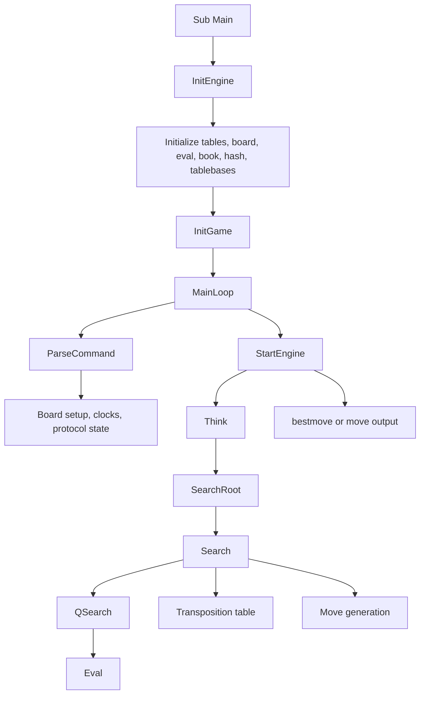

# ChessBrainVB VB6 Architecture

This document describes the VB6 chess engine in this directory:

- Project: `ChessBrainVB.vbp`
- Engine root: `D:\Chess\ChessBrainVB_V0450\SourcePonder`
- Startup object: `Sub Main`
- Output: `ChessBrainVB.exe`

The VB.NET engine is intentionally out of scope. This document only covers the VB6 project and the files included by `ChessBrainVB.vbp`.

## High-Level Shape

ChessBrainVB is a protocol-driven chess engine. In normal use it is started by a chess GUI through XBoard/WinBoard or UCI-style commands. The engine does not provide a full chessboard UI. `Forms\Main.frm` is a small launcher/configuration form used when the executable is started without protocol mode.

The main runtime path is:



## Project Composition

`ChessBrainVB.vbp` builds a VB6 EXE and includes these main components:

- `Modules\ChessBrainVB.bas`: application startup, engine initialization, command loop, UCI/XBoard command parsing, global protocol state, ponder state.
- `Modules\Const.bas`: constants, board square numbers, piece IDs, enums, and shared types such as `TMOVE`, `TMovePicker`, `TScore`, and `TMatchInfo`.
- `Modules\Board.bas`: board representation, move generation, make/unmake, move text conversion, legal move checks, draw and game-state helpers.
- `Modules\Search.bas`: search driver, iterative deepening, root search, alpha-beta search, quiescence search, principal variation, move ordering, pruning, reductions, and best-move output.
- `Modules\Eval.bas`: static evaluation, tapered middlegame/endgame scoring, piece-square tables, mobility, pawn structure, passed pawns, king safety, threats, material imbalance, and specialized endgames.
- `Modules\Hash.bas`: Zobrist keys, transposition table, hash probing/storing, hash sizing, material hash, and shared-memory layout for helper processes.
- `Modules\Time.bas`: time allocation, elapsed-time calculation, optimal/maximum time limits, and search stop decisions.
- `Modules\Book.bas`: UCI-line opening book loading and book move selection.
- `Modules\EPD.bas`: EPD/FEN-like position parsing.
- `Modules\IO.bas`: standard input/output handling, UCI/XBoard output, INI access, tracing, game read/write helpers, and tablebase integration.
- `Modules\CmdOutput.bas`: process/command-output helper code used by external communication paths.
- `Modules\Process.bas`: Win32 `CreateProcess` wrapper used to start hidden helper processes for multi-core operation.
- `Modules\HashMap.cls`: memory-mapped file wrapper used for shared read/write memory between engine processes.
- `Forms\Main.frm`: non-engine launcher/configuration form.

The project references Microsoft Scripting Runtime (`scrrun.dll`) and uses Win32 API calls from `kernel32` for console pipes, INI files, sleeping, process creation, and memory-mapped files.

## Startup and Runtime Flow

`Sub Main` in `Modules\ChessBrainVB.bas` is the executable entry point. It initializes path and application globals, reads INI flags, parses command-line arguments, sets thread state, opens communication handles for the main engine process, and chooses the runtime mode.

Important startup decisions:

- `-xboard`, `/xboard`, or `xboard` enables protocol mode.
- `-log`, `/log`, or `log` enables logging.
- `threadN` marks a helper process, where the helper receives a thread number and participates in shared-memory search.
- If protocol mode is active, `InitEngine` runs and then `MainLoop` starts.
- If protocol mode is not active and no configured WinBoard path forces protocol mode, `frmMain.Show` displays the launcher form.

`InitEngine` prepares the reusable engine state:

- Clears search, board, move, PV, hash, and game arrays.
- Initializes piece colors, board directions, ranks/files, distances, attack tables, and square-between tables.
- Builds the startup board and piece-square tables.
- Initializes evaluation parameters, material imbalance, EPD tables, opening book, Zobrist keys, tablebases, and the initial game state.

`MainLoop` is the long-running engine loop. Each iteration first calls `StartEngine`, which returns immediately if it is not the engine's turn or if the engine is in force mode. The loop then polls for new GUI input, reads available commands, and passes them to `ParseCommand`.

## Protocol Handling

`ParseCommand` handles both UCI and WinBoard/XBoard-style command streams. It accepts command batches separated by line feeds, which is important because a GUI can send several commands at once.

UCI support includes:

- `uci`, `uciok`, engine ID output, and option declarations.
- `ucinewgame`.
- `isready` / readiness handling.
- `setoption name Hash value ...`.
- `setoption name Threads value ...`.
- `setoption name Ponder value true|false`.
- `position` and move-list setup.
- `go`, including normal search and ponder search.
- `ponderhit`, `stop`, and `quit`.

WinBoard/XBoard handling manages engine state such as new games, force mode, time controls, post/analyze behavior, move input, and result commands.

Protocol output is centralized through `SendCommand` in `Modules\IO.bas`. In normal VB6 EXE mode it writes to stdout with `WriteFile`. Search information is emitted by helpers such as `SendThinkInfo`, using UCI `info ...` lines in UCI mode and WinBoard-compatible post output otherwise.

## Board Model and Move Generation

The board uses a 120-cell mailbox array in `Modules\Board.bas`:

- Legal chess squares are `21` through `98`, with constants such as `SQ_A1 = 21` and `SQ_H8 = 98`.
- Off-board frame cells surround the playable board so piece move loops can stop on `FRAME`.
- `Board(MAX_BOARD)` stores piece IDs or `NO_PIECE`.
- `Pieces(32)` maps piece-list indexes to board squares.
- `Squares(MAX_BOARD)` maps board squares back to piece-list indexes.
- `WKingLoc` and `BKingLoc` track king locations.
- `Moved(MAX_BOARD)` tracks castling and moved-piece state.
- `EpPosArr(0 To MAX_DEPTH)` stores en-passant dummy-square state by ply.

Piece IDs and square constants are defined in `Modules\Const.bas`. White pieces have bit `1` set, so many color checks use `(piece And 1)`.

Move data is represented by `TMOVE`, which contains:

- `From` and `Target` squares.
- Moving, captured, promoted, castle, and en-passant fields.
- `OrderValue` and `SeeValue` for search ordering.
- `IsLegal` and `IsChecking` flags.

`GenerateMoves(Ply, bCapturesOnly, NumMoves)` generates pseudo-legal moves into the global `Moves(Ply, index)` array. It uses fast king-check helper tables (`FillKingCheckW` and `FillKingCheckB`) and piece-specific helpers for pawns, knights, sliders, kings, and castling. Legality is checked later by routines such as `CheckLegal` and `CheckLegalNotInCheck`.

The search uses make/unmake instead of copying full board states. `MakeMove` applies a move at the current ply and `UnmakeMove` restores the previous state.

## Search Architecture

The search pipeline is explicitly documented in `Modules\Search.bas`:

```text
Think -> SearchRoot -> Search -> QSearch -> Eval
```

`StartEngine` prepares a search when the engine is allowed to move. It initializes counters, search ply, time start, multi-process shared data, and then calls `Think`.

Search responsibilities:

- `Think`: iterative deepening driver. It increases root depth until the search is complete, stopped, or out of time.
- `SearchRoot`: generates root moves and starts recursive search from ply 2.
- `Search`: alpha-beta recursive search with pruning, reductions, extensions, move ordering, hash use, killer/history/countermove/continuation history, and draw/mate handling.
- `QSearch`: quiescence search for captures and selected checking moves at leaf positions.
- `Eval`: static evaluation when the tactical search reaches a quiet enough position.

Important search state includes:

- `PV` and `PVLength` for principal variation tracking.
- `Killer`, `History`, `CaptureHistory`, `CounterMove`, and `ContinuationHistory` for move ordering.
- `MovesList` for the currently searched path.
- `FinalMove` and `FinalScore` for the move eventually returned to the GUI.
- `RootDepth`, `Nodes`, `QNodes`, `MaxPly`, and related counters for reporting and stopping.

Pondering is coordinated by globals in `Modules\ChessBrainVB.bas`, including `pbPonderMode`, `pbPondering`, `PonderMove`, and `MovePondering`. `GetPonderMove` in `Modules\Search.bas` derives a ponder candidate from the principal variation. Time checks avoid stopping only because optimal time was reached while `pbPondering` is true.

## Evaluation

`Modules\Eval.bas` implements a Stockfish-inspired tapered evaluation. It combines middlegame and endgame components through `TScore`, then scales them by game phase.

Major evaluation areas include:

- Material and non-pawn material.
- Piece-square tables for all piece types.
- Mobility for knights, bishops, rooks, and queens.
- Pawn structure, including isolated, backward, doubled, connected, lever, and passed-pawn terms.
- Threats, hanging pieces, overloads, safe checks, and attacks on the queen.
- King safety, pawn shelter, pawn storm, king attackers, and pawnless flanks.
- Material imbalance using quadratic piece relationships.
- Specialized endgame scaling and known endgame evaluation helpers.

`InitEval` reads many tuning values from `ChessBrainVB.ini`, including contempt, piece values, game-phase limits, and scale factors for position, mobility, pawn structure, passed pawns, threats, and king attack/defense.

## Hashing and Transposition Table

`Modules\Hash.bas` owns hash keys, transposition storage, and multi-process hash sharing.

The engine uses a two-part `THashKey`:

- `HashKey1 As Long`
- `HashKey2 As Long`

Zobrist tables are initialized for pieces, squares, side to move, and castling-related state. The transposition table stores clustered `HashTableEntry` records with position keys, depth, generation, bound type, best move, evaluation, static evaluation, PV hit flag, and optional thread information.

Hash behavior is controlled by INI and GUI values:

- `HASHSIZE`
- `HASHSIZE_IGNORE_GUI`
- `HASH_VERIFY`
- `HASH_COLL_TRACE`
- `HASH_MAP_FILE`
- `HASH_USED`

Single-thread mode uses an in-process VB array. Multi-thread/multi-process mode uses a memory-mapped file through `clsHashMap`, and helper processes read shared board, game, status, PV, and hash data from mapped memory.

## Time Management

`Modules\Time.bas` calculates search budgets and stop decisions.

`AllocateTime` computes:

- `OptimalTime`: the preferred search duration.
- `MaximumTime`: the hard upper budget for the move.

Inputs include remaining time, increment, moves to time control, game move count, move overhead, thread count, and ponder mode. Ponder mode increases optimal time because the engine may already be thinking during the opponent's turn.

`CheckTime` compares elapsed time against an adjusted optimum. It considers root fail-low behavior, score improvement, and best-move instability. If the engine is pondering, it does not stop simply because the normal move budget has been reached.

## Opening Book

`Modules\Book.bas` reads an opening book as UCI move lines. The default file name comes from the `OPENING_BOOK` INI key, with `CB_BOOK.TXT` as the default. If no file is available and `USE_INTERNAL_BOOK=1`, the internal book is initialized.

`ChooseBookMove`:

- Builds the current game line in coordinate/UCI notation.
- Finds matching book continuations.
- Generates legal pseudo-moves for the current position.
- Returns a matching legal move as a `TMOVE`.

The file comments note that the book assumes games started from the normal initial position; FEN/EPD-started games are not supported for book lookup.

## Position, Game, and Configuration I/O

`Modules\EPD.bas` parses EPD/FEN-like strings through `ReadEPD`. It clears the board, places pieces, sets the side to move, applies castling rights, handles en-passant target squares through dummy pieces, and reads the halfmove clock when present.

`Modules\IO.bas` also contains:

- `ReadINISetting` and `WriteINISetting`, backed by `GetPrivateProfileStringA` and `WritePrivateProfileStringA` using the `[Engine]` section of `ChessBrainVB.ini`.
- `ReadGame` and `WriteGame` helpers for simple coordinate-move game files.
- `WriteTrace` for trace files in the engine directory.
- Tablebase setup and probing integration.
- GUI/protocol output formatting.

The central configuration file is `ChessBrainVB.ini`. It controls protocol defaults, logging/tracing, book use, hash size, threading, move overhead, evaluation tuning, contempt, and tablebase paths/settings.

## Multi-Core and Helper Processes

The code uses helper processes rather than native VB6 threads. The main process coordinates them through shared memory:

- `Modules\Process.bas` starts hidden helper processes with `CreateProcess`.
- Helper processes are identified by `threadN` command-line arguments.
- `Modules\Hash.bas` defines the shared-memory layout for thread status, best PVs, board state, moved flags, side to move, game moves, game hash history, and search data.
- `Modules\HashMap.cls` wraps `CreateFileMapping`, `OpenFileMapping`, `MapViewOfFile`, `UnmapViewOfFile`, and memory copy/compare functions.

At search start, the main process writes game data into the map and sets thread status so helpers can begin. Helpers read the shared game data, search assigned work, and publish status or PV data back through the map.

This design keeps the core VB6 code single-threaded per process while still allowing multiple CPU cores to contribute.

## Tablebases

Tablebase state and output are mostly handled in `Modules\IO.bas`, with search-facing flags in `Modules\Search.bas`. The engine has Syzygy-related UCI options and INI settings for path, maximum piece set, and maximum probing ply. Search code can use tablebase information at the root and inside search when enabled.

## UI Boundary

`Forms\Main.frm` is not a chessboard interface. It is a small form used to configure or launch WinBoard when the engine is not running in protocol mode. The actual chess interaction is expected to come from an external GUI using stdin/stdout protocol commands.

`Forms\DebugMain.frm` and `ChessBrainVB_debug.vbp` are related debug tooling, not part of the main `ChessBrainVB.vbp` build described here.

## Operational Notes

- The normal engine executable is a 32-bit VB6 program, so practical hash memory is limited. `Hash.bas` caps hash size and has separate IDE limits.
- Most shared state is stored in global module-level arrays and variables, which is idiomatic for this VB6 engine and keeps search hot paths simple.
- The engine relies on command polling during search so `stop`, `quit`, analyze commands, and ponder transitions can be handled promptly.
- The main architectural boundary is protocol loop versus engine core: `ChessBrainVB.bas` and `IO.bas` manage GUI communication, while `Board.bas`, `Search.bas`, `Eval.bas`, `Hash.bas`, and `Time.bas` implement chess strength.
